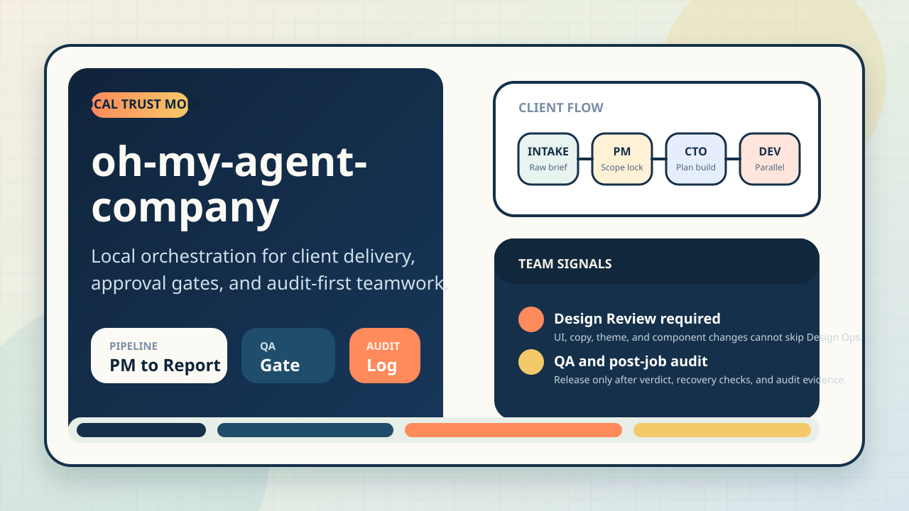

# oh-my-agent-company

[Korean](README.ko.md) | [English](README.en.md) | [Simplified Chinese](README.zh-CN.md)

Local multi-agent orchestration template for client delivery.

This project receives client requests, refines work, runs a structured pipeline,
and delivers auditable outcomes with approval gates.

## Project Hero


## Brand Assets
- README hero SVG: `assets/readme-hero.svg`
- GitHub social preview PNG: `assets/github-social-preview.png`
- GitHub social preview setting: `Settings -> General -> Social preview`
- Regenerate preview asset: `python3 ./scripts/generate_social_preview.py`

## Why This Repo Is Global-Ready
- Dedicated README variants for Korean, English, and Simplified Chinese
- MIT license for open collaboration
- End-to-end auditable workflow: `request -> assign -> execute -> QA -> report -> response`
- Safe local operation with health checks and restart controls

## Repository Information
- Repository: `https://github.com/junghyun2003/oh-my-agent-company`
- License: `MIT` (`LICENSE`)
- Main server: `scripts/orchestrator_server.py`
- Dashboard: `dashboard/index.html`

## Installation Guide
### 0. Environment self-check
```bash
bash ./scripts/setup_dev_env.sh --check-only
bash ./scripts/ci_local_check.sh --quick
```
- You should see `codex`, `node`, `npm`, `npx`, and the Playwright wrapper before running the full verification flow.
- The Codex runtime explicitly overrides `model_reasoning_effort="high"` regardless of global `~/.codex/config.toml`.

### A. Python-only quick run
```bash
python3 --version
./scripts/infra_server_ctl.sh ensure
./scripts/infra_server_ctl.sh status
```

### B. npm-supported local setup
If Node.js and npm are installed:
```bash
npm install
npm run install:local
npm run bootstrap:local
```

If npm is missing:
```bash
node --version
npm --version
```
Install Node.js LTS and npm first, then run `npm install`.

## Quick Start
1. Clone and enter the workspace.
```bash
git clone https://github.com/junghyun2003/oh-my-agent-company.git
cd oh-my-agent-company
```

2. Start the server in the recommended safe mode.
```bash
./scripts/infra_server_ctl.sh start
./scripts/infra_server_ctl.sh status
```

3. Open the dashboard.
- Canonical URL: `http://localhost:18765/dashboard/`
- Redirect aliases: `http://localhost:18765/`, `http://localhost:18765/dashboard`, `http://localhost:18765/dashboard/index.html`
- Lightweight mode: `http://localhost:18765/dashboard/?light=1`
- Hash routes such as `#section-status` and the last active section persist after refresh.

4. Verify health.
```bash
./scripts/infra_server_ctl.sh health
```

5. Restart safely during development.
```bash
./scripts/infra_server_ctl.sh restart
```

## 10-Minute Onboarding
1. Choose an installation path.
```bash
# npm path
npm install
npm run install:local
npm run bootstrap:local

# python path
./scripts/infra_server_ctl.sh ensure
bash ./scripts/bootstrap_local.sh

# require Node.js and fail if npm is missing
REQUIRE_NODE=1 bash ./scripts/bootstrap_local.sh
```

2. Confirm access.
- `http://localhost:18765/dashboard/`

3. Run immediate troubleshooting if needed.
```bash
./scripts/infra_server_ctl.sh doctor
./scripts/infra_server_ctl.sh incident
./scripts/infra_server_ctl.sh logs 120
```

4. Run quick automation checks.
```bash
bash ./scripts/ci_local_check.sh --quick
```

## Update Strategy
- P0: keep service availability stable with `watch-start`, `ensure`, and `doctor`
- P1: improve UX quality across `system`, `light`, and `dark` themes
- P2: strengthen operational transparency through work cards and one-glance boards
- Change order: `policy -> code -> verification`

## Fast Review Map
- Main overview: `README.en.md`
- Team role matrix: `docs/TEAM_ROLE_MATRIX.md`
- Team-level responsibilities: `teams/AGENTS.md`, `teams/*/AGENTS.md`
- Orchestration blueprint: `AGENT_ORCHESTRATION.md`
- Runtime entrypoint: `scripts/orchestrator_server.py`
- Verification helpers: `python3 ./scripts/docs_sync_check.py`, `python3 ./scripts/team_policy_check.py`, `python3 ./scripts/language_policy_check.py`

## Client Operation Flow
1. Request intake: register the raw client request.
2. Work assignment: select request and repository, then define the mission.
3. Pipeline execution: `PM -> CTO -> Dev(parallel) -> Design Review -> QA -> Report`
4. Approval handling: process `manual_pre`, `manual_post`, or `manual_both` gates.
5. Delivery response: send the structured client response template.
6. Audit review: validate evidence in append-only audit logs.

## Transparent Delivery Model
- Every client request is visible on a single board.
- Stages: `Intake -> PM -> CTO -> Dev -> Design Review -> QA -> Report -> Done`
- Visible fields: `assigned team`, `blocking issues`, `next update time`, `latest change`
- Team instructions are recorded as standardized work cards with `goal`, `scope`, `acceptance`, `dependency`, `risk`, and `ETA`.
- CEO, CTO, and team-lead decisions remain traceable through policy docs and audit logs.
- The dashboard shows rolling 7-day KPI cards for requests, success rate, lead time, and failures.

## Core Concepts
- Local Trust Mode by default, so local operation does not require login
- Collapsed operator and token inputs with an optional advanced input panel
- Repository policy enforcement via `allowed_actions` and `writable_paths`
- Approval modes: `auto`, `manual_pre`, `manual_post`, `manual_both`
- Audit-first delivery with `post_job_audit` after completion
- Team leads and a Tech Leader for governance
- Theme modes: `system`, `light`, `dark`
- Tycoon-style pixel dashboard for team activity and queue visibility

## Runtime Commands
Safe infrastructure control script:
```bash
./scripts/infra_server_ctl.sh start
./scripts/infra_server_ctl.sh stop
./scripts/infra_server_ctl.sh restart
./scripts/infra_server_ctl.sh status
./scripts/infra_server_ctl.sh ensure
./scripts/infra_server_ctl.sh doctor
./scripts/infra_server_ctl.sh watch-start
./scripts/infra_server_ctl.sh watch-status
./scripts/infra_server_ctl.sh health
./scripts/infra_server_ctl.sh incident
./scripts/infra_server_ctl.sh incident-summary
./scripts/infra_server_ctl.sh logs 120
bash ./scripts/incident_notify.sh --dry-run
```
- Webhook retries: `INCIDENT_NOTIFY_RETRY_MAX=3 INCIDENT_NOTIFY_BACKOFF_SEC=1 bash ./scripts/incident_notify.sh --webhook <url>`

macOS `launchd` auto-start:
```bash
bash ./scripts/install_launchd_agent.sh
bash ./scripts/install_launchd_agent.sh --dry-run
bash ./scripts/uninstall_launchd_agent.sh
```

Linux `systemd` auto-start reference:
```bash
sudo tee /etc/systemd/system/oh-my-agent-company.service >/dev/null <<'UNIT'
[Unit]
Description=oh-my-agent-company orchestrator
After=network.target

[Service]
Type=simple
WorkingDirectory=/path/to/oh-my-agent-company
ExecStart=/usr/bin/python3 /path/to/oh-my-agent-company/scripts/orchestrator_server.py
Restart=always
Environment=ORCHESTRATOR_PORT=18765

[Install]
WantedBy=multi-user.target
UNIT
sudo systemctl daemon-reload
sudo systemctl enable --now oh-my-agent-company.service
```

Windows Task Scheduler reference:
1. Trigger: At log on
2. Action: Start a program
3. Program/script: `python`
4. Arguments: `scripts\\orchestrator_server.py`
5. Start in: `C:\\path\\to\\oh-my-agent-company`

Availability hardening defaults:
- `ensure` retries up to `3` auto-recovery attempts. Override with `ENSURE_MAX_ATTEMPTS`.
- Health stability probes run before the service is marked healthy. Override with `STABILITY_PROBES`.
- Watchdog auto-start is enabled by default on `start` and `ensure`. Set `INFRA_AUTO_WATCHDOG=0` to disable it.
- `incident` prints standard diagnosis values: `OK`, `NOT_RUNNING`, `PORT_CONFLICT`, `HEALTH_FAIL`, `PID_STALE`
- Lifecycle events are written to `state/orchestrator_lifecycle.log`

npm-supported commands:
```bash
npm run install:local
npm run bootstrap:local
npm run server:start
npm run server:status
npm run server:ensure
npm run server:watch
npm run server:health
npm run check:api
npm run check:smoke
npm run check:team-policy
npm run check:codex
npm run check:playwright:ops
npm run check:playwright:visual
npm run check:theme
npm run check:local
npm run check:local:quick
npm run ops:queue:summary
npm run ops:queue:dry-run
npm run ops:queue:apply
npm run todo:list
npm run todo:start -- 1
npm run todo:complete -- 1 --verify --commit --push
```

Step-by-step TODO workflow source of truth:
- `TODO_TRACKER.json`
- `TODO_EXECUTION_PLAN.md`
- `todo_workflow.py complete --commit` includes the step state update and code change in the same commit.

Queue management:
```bash
python3 ./scripts/ops_queue_manager.py summary
python3 ./scripts/ops_queue_manager.py apply --dry-run
python3 ./scripts/ops_queue_manager.py apply --dispatch-recovery-min 5
python3 ./scripts/ops_queue_manager.py apply --requeue-failed
```

DB backup and restore:
```bash
bash ./scripts/db_maintenance.sh backup
bash ./scripts/db_maintenance.sh list
bash ./scripts/db_maintenance.sh restore ./state/backups/agent_company-YYYYMMDDTHHMMSSZ.db
bash ./scripts/db_maintenance.sh prune 15
bash ./scripts/db_restore_drill.sh --dry-run
```
- `schema_version` is tracked in `state_meta` for startup migration baselines.
- Operation policy: at least one daily backup, one extra backup before release, default retention of `15`, and one monthly restore drill.

Queue management API:
```bash
curl -s http://localhost:18765/api/ops/queue | jq
curl -s http://localhost:18765/api/ops/runtime | jq
curl -s http://localhost:18765/api/ops/preflight | jq

curl -s -X POST http://localhost:18765/api/ops/queue/manage \
  -H 'Content-Type: application/json' \
  -d '{"owner_id":"local-owner","action":"recover_stalled"}' | jq

curl -s -X POST http://localhost:18765/api/ops/queue/manage \
  -H 'Content-Type: application/json' \
  -d '{"owner_id":"local-owner","action":"requeue_failed","job_ids":["job-123"]}' | jq

curl -s -X POST http://localhost:18765/api/ops/queue/manage \
  -H 'Content-Type: application/json' \
  -d '{"owner_id":"local-owner","action":"reprioritize","job_ids":["job-123"],"priority":"urgent"}' | jq
```
- The operations settings view exposes the same information through the `Codex Preflight` card.
- `GET /api/ops/preflight` includes `node_path`, `npm_path`, `npx_path`, `playwright_wrapper_path`, `playwright_ready`, `codex_reasoning_effort`, `effective_codex_args`, `issues`, and `remediations`.
- `GET /api/health` includes `worker_health`.
- `GET /api/requests`, `GET /api/jobs`, and `GET /api/audit` support `limit` and `offset`.
- Request and job pagination in the dashboard is backed by server-side `offset` refetching.
- Validation rules:
  - `action`: `recover_stalled`, `requeue_failed`, `reprioritize`
  - `job_ids`: `job-*` format, maximum `20` items when required
  - `priority`: `urgent`, `high`, `normal`, `low`
- Every action records `before_counts`, `after_counts`, and `delta_counts` in the `ops_queue_action_summary` audit event.
- The audit UI supports filters for `kind`, `job`, `request`, `owner`, and `phase`.

Smoke test automation:
```bash
bash ./scripts/api_contract_smoke.sh
bash ./scripts/smoke_core_flows.sh
bash ./scripts/runtime_recovery_smoke.sh
bash ./scripts/codex_runtime_canary.sh
bash ./scripts/playwright_ops_e2e.sh
bash ./scripts/ci_local_check.sh
```
- `api_contract_smoke.sh`: validates core `/api/*` contracts
- `smoke_core_flows.sh`: verifies request intake, work assignment, pre-approval, `job_done`, and `post_job_audit`
- `runtime_recovery_smoke.sh`: verifies `dispatching` orphan recovery and restart reconciliation for `waiting_pre_approval`
- `codex_runtime_canary.sh`: validates the `codex exec --ephemeral -s read-only -m gpt-5-codex -c model_reasoning_effort="high"` path
- `playwright_ops_e2e.sh`: verifies `auto` and `manual_pre` no-change flows in a real browser
- `ci_local_check.sh`: runs `API smoke -> flow smoke -> runtime recovery smoke -> Codex canary -> Playwright ops E2E -> visual/theme regression`

Playwright visual regression:
```bash
bash ./scripts/visual_regression_playwright.sh
bash ./scripts/theme_regression_check.sh
```

Strict mode:
```bash
STRICT_PLAYWRIGHT_VISUAL=1 bash ./scripts/visual_regression_playwright.sh
STRICT_THEME_REGRESSION=1 bash ./scripts/theme_regression_check.sh
STRICT_PLAYWRIGHT_E2E=1 bash ./scripts/playwright_ops_e2e.sh
STRICT_VISUAL_BASELINE=1 bash ./scripts/visual_regression_playwright.sh
```

`npx` prerequisites:
```bash
node --version
npm --version
npm install -g @playwright/cli@latest
playwright-cli --help
```
- Baseline screenshots live in `output/playwright/baseline/*`.
- Latest runs live in `output/playwright/current/*`.

Direct run fallback:
```bash
python3 scripts/orchestrator_server.py
```

Run on a different port:
```bash
ORCHESTRATOR_PORT=19090 python3 scripts/orchestrator_server.py
```

Tech Leader audit:
```bash
./scripts/tech_leader_audit.sh
python3 ./scripts/docs_sync_check.py
python3 ./scripts/team_policy_check.py
python3 ./scripts/kpi_weekly_report.py --dry-run
python3 ./scripts/kpi_weekly_report.py --days 7 --output ./reports/kpi/weekly-kpi.json
python3 ./scripts/kpi_weekly_report.py --days 7 --save-latest --save-history
bash ./scripts/security_scan.sh --dry-run
python3 ./scripts/language_policy_check.py
```
- Add false-positive exclusions to `.security_scan_allowlist` by substring.

Pre-push enforcement:
```bash
bash ./scripts/install_pre_push_hook.sh
bash ./scripts/install_pre_commit_hook.sh
```
- The installed hook runs `python3 ./scripts/docs_sync_check.py`, `python3 ./scripts/team_policy_check.py`, `python3 ./scripts/language_policy_check.py`, and `bash ./scripts/smoke_core_flows.sh` before every push.
- Push is blocked when policy docs and runtime behavior are out of sync.

Built-in stalled-job recovery:
- The orchestrator checks stalled jobs on a polling interval.
- On boot, `dispatching`, `in_progress`, `waiting_pre_approval`, and `waiting_post_approval` jobs are treated as orphaned and reconciled automatically.
- `dispatching` is quickly requeued using the `dispatch_recovery_min` threshold, which defaults to `5` minutes.
- Jobs interrupted before changes are applied are requeued with the same job ID. Jobs interrupted after changes may be marked `failed(orchestrator_restart_recovery)` for manual reassignment.
- App setting keys: `queue_warn_min`, `dispatch_recovery_min`, `in_progress_timeout_min`, `ops_recovery_poll_sec`, `worker_concurrency`

## Data and Artifacts
- DB: `state/agent_company.db`
- Requests table: `requests`
- Jobs table: `jobs`
- Agent status table: `agent_status`
- Audit table: `audit_events`
- Deliverables: `deliverables/`
- Runtime state artifacts such as `state/*.log`, `state/*.pid`, and `state/backups/*` are treated as volatile and excluded from git tracking.

## Team and Governance Docs
- Docs index: `docs/INDEX.md`
- 10-minute onboarding: `docs/ONBOARDING_10MIN.md`
- Company policy: `AGENTS.md`
- Team role matrix: `docs/TEAM_ROLE_MATRIX.md`
- Team index: `teams/AGENTS.md`
- Team docs: `teams/*/AGENTS.md`
- Orchestration blueprint: `AGENT_ORCHESTRATION.md`
- Component governance: `COMPONENT_REGISTRY.md`
- Theme policy: `teams/design-ops/THEME_POLICY.md`
- Language policy: `teams/design-ops/LANGUAGE_POLICY.md`
- Commit/push rulebook: `COMMIT_PUSH_RULES.md`
- Marketing guide: `MARKETING_PLAYBOOK.md`
- Governance evidence pack: `GOVERNANCE_SOURCES_2026-02-21.md`

## Open Source Collaboration
- How to contribute: `CONTRIBUTING.md`
- Security reporting: `SECURITY.md`
- CI workflow: `.github/workflows/ci.yml`
- Fork policy: `FORK_CUSTOMIZATION_POLICY.md`
- Upstream baseline: `UPSTREAM_BASELINE.env`
- Custom log: `CUSTOMIZATION_LOG.md`

## Fork Users: Distinguish Original vs Customized
1. Set your baseline in `UPSTREAM_BASELINE.env`.
2. Record custom changes in `CUSTOMIZATION_LOG.md`.
3. Use commit footers:
   - `Change-Origin: upstream|custom`
   - `Upstream-Ref: <tag-or-sha-or-none>`
4. Run a diff report before release.
```bash
./scripts/fork_diff_report.sh
./scripts/fork_diff_report.sh --save
```
- Saved report path: `reports/fork/customization-report-<UTC>.md`
- Even if `UPSTREAM_REF` is empty, the report falls back through `upstream branch -> origin/main -> origin/master -> latest tag -> root commit`.

## Troubleshooting
- Browser cannot connect:
  - `./scripts/infra_server_ctl.sh status`
  - `./scripts/infra_server_ctl.sh ensure`
  - `./scripts/infra_server_ctl.sh doctor`
  - `./scripts/infra_server_ctl.sh restart`
  - `./scripts/infra_server_ctl.sh logs 120`
- Request or assignment API returns `403`:
  - If strict owner mode is enabled, check `owner_id` mismatch.
  - If token mode is enabled, provide `owner_token`.
- Port conflict:
  - Stop the conflicting process and restart the server.
- Policy errors:
  - Inspect `repo_policies` and `app_settings` in the DB.

## Notes for Clients
This repository evolves rapidly under CEO and CTO leadership, team leads,
and transparent execution audits. Readability, onboarding, and operational
trust are treated as product requirements.
